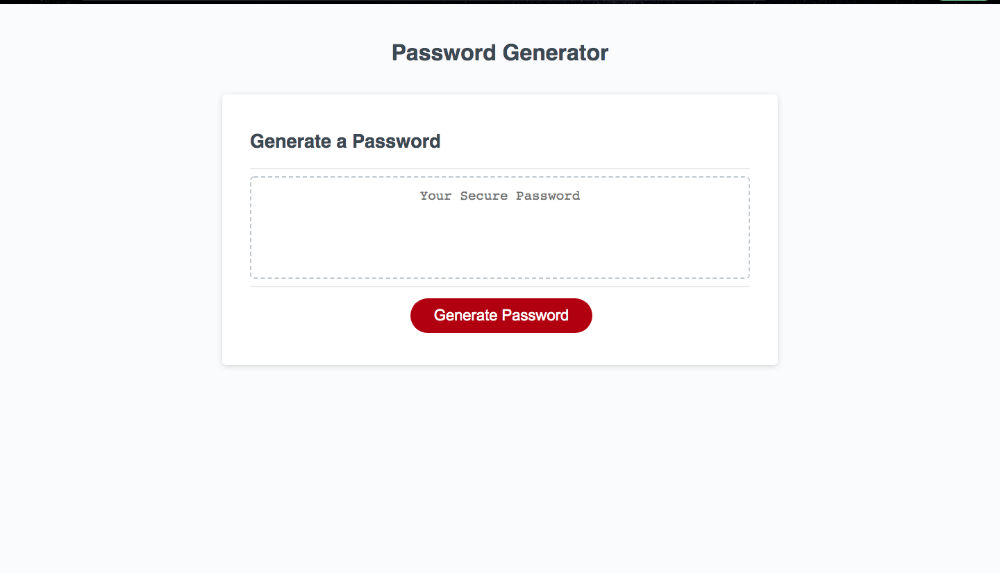

# Password Generator

This application allows the user to generate a random password for use on any site. 

The user can select the length and characters of their choice (e.g., lowercase, uppercase, numeric, and special) to include in the password. 

## Contact

If you wish to contact me you can reach me at melanieuhrich13@gmail.com.

## Screenshot 

# Link to Deployed Application

https://melanieuhrich.github.io/Password-Generator/ 

